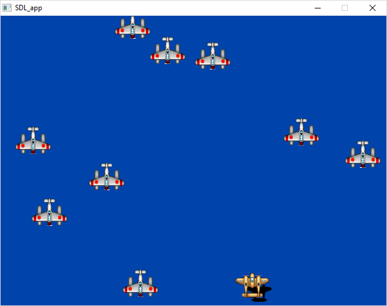
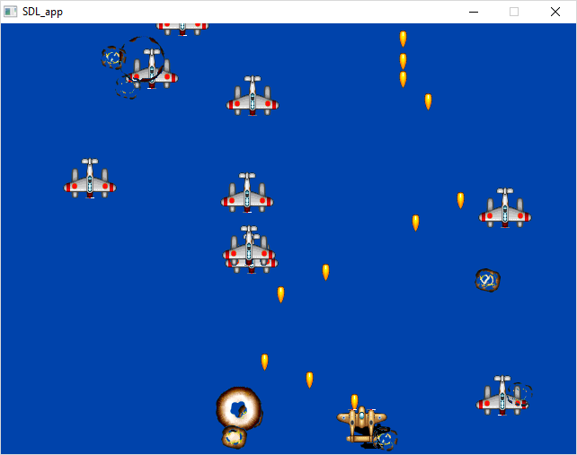
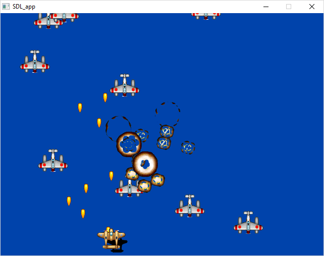
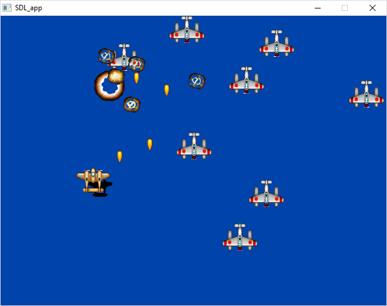
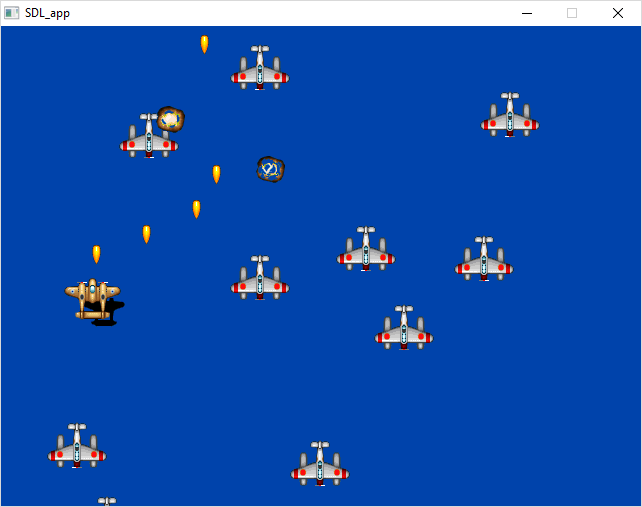
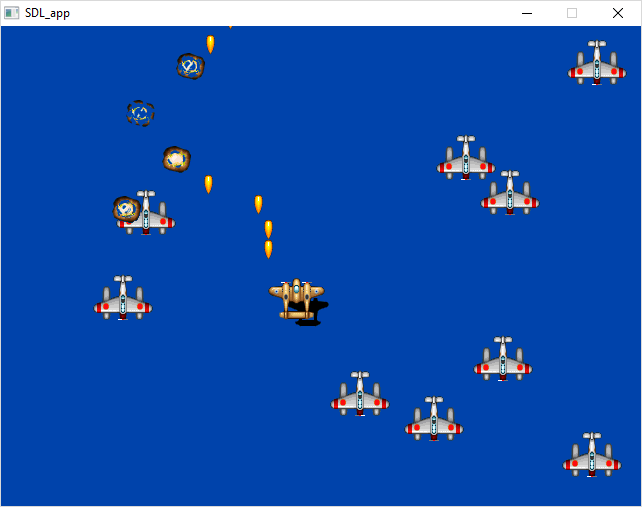

# Shooter

A Shooting Game (actually just an engine).

All source code is in the folder named `src`.

The game/engine is in a very early stage, I started working on this in December of 2003 but wasn't able to continue after a few weeks. You are free to modify/enhance/do anything you want with the software.

## Screenshots

## Links

* [SDL](http://libsdl.org/)
* arifeldman.com for graphics

## Tasks

### Objects

- [x] ~Enemy ships~
- [x] ~The hero ship~
- [ ] Power-ups
- [ ] Score
- [ ] No. of hero ships left
- [ ] Shield meter
- [ ] Current weapon indicator
- [x] ~Bullets~
- [x] ~Explosions/particles~
- [ ] Small explosions when a ship is hit
- [ ] Sound effects/music
- [ ] Buttons
- [ ] Menu

### Enemy Ships

- [x] ~Hit points~
- [x] ~Damage~
- [x] ~Explodes when killed~
- [x] ~Dead/alive~
- [x] ~Weapon type~
- [ ] Animation type
- [x] ~Can fire~
- [ ] Damaged when collided with hero, has damage delay

### The Player's Ship

- [x] ~Hit points~
- [x] ~Damage~
- [x] ~Explodes when killed~
- [x] ~Dead/alive~
- [x] ~Weapon/bullet type~
- [ ] Animation type
- [x] ~Can fire~
- [x] ~Can be controlled by the keyboard~
- [ ] Can be controlled by the joystick
- [ ] Immortal for a few seconds after re-spawn

### Bullet

- [x] ~Moves up or down / direction~
- [x] ~X, y origin~
- [ ] Type - handled by the game engine
- [ ] Different animations

### Game

- [ ] Pause when window not focused

### Issues

- [ ] Fix framerate, too fast on current machines
- [ ] Optimize by removing bitmask creation inside the bullets' constructor and then
- [ ] Allow the engine to manage the bitmasks of all the bullets
